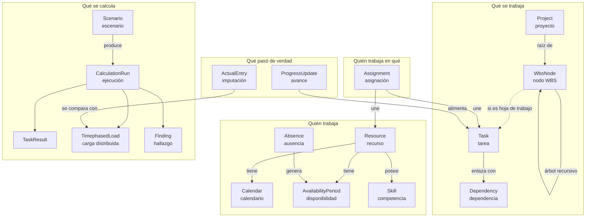

# 02 · Modelo de dominio

Vocabulario único del sistema. Cada término tiene **un** significado, en el código,
en la base de datos, en la API y en la UI. Cuando la UI muestre otra palabra, será
una traducción de presentación, nunca un concepto nuevo.

## 2.1 Mapa de conceptos



## 2.2 Entidades

### Resource — recurso

Una persona (o un equipo tratado como bloque, o una partida de coste). Lo que la
define para el cálculo es **cuánta capacidad aporta y cuándo**.

- `resource_kind`: `person` | `team` | `material` | `cost`. Sólo `person` y `team`
  consumen capacidad.
- Tiene un **calendario** (P: jornada de 40 h vs. 35 h vive aquí, no como un número
  suelto).
- Tiene **periodos de disponibilidad** con vigencia: «al 80 % del 01/03 al 30/06».
- Tiene **tarifas de coste** con vigencia (nunca una tarifa única eterna).
- La capacidad diaria efectiva es *derivada*: `calendario ∩ disponibilidad ∩ ausencias`.

> **Invariante R1.** Los periodos de disponibilidad de un recurso no se solapan.
> **Invariante R2.** La capacidad diaria derivada nunca es negativa.

### Calendar — calendario

Define qué minutos son laborables. Es la unidad de medida de todo el sistema: sumar
«3 días» significa sumar los minutos laborables de tres días *según un calendario
concreto*.

- **Jerárquico**: un calendario puede heredar de otro y sobrescribirlo
  (`Base DE` → `Base BW` → `Ana 80 %`).
- **Patrón semanal con vigencia**: el patrón puede cambiar en el tiempo (reducción de
  jornada desde julio) sin perder el histórico.
- **Excepciones**: festivos, cierres, jornadas especiales, con recurrencia opcional.
- **Orden de resolución** para una tarea: `calendario de tarea` → `calendario del
  recurso asignado` → `calendario del proyecto` → `calendario base`. El primero que
  exista gana, y el motor deja constancia de cuál usó.

> **Invariante C1.** Un calendario no puede heredar de sí mismo (sin ciclos).
> **Invariante C2.** Los intervalos laborables de un día no se solapan y están ordenados.

### Project — proyecto

Contenedor con fecha de referencia, calendario por defecto, estado y prioridad. La
prioridad es un entero y se usa como criterio determinista en la nivelación.

### WbsNode — nodo de la estructura de desglose

**Un solo árbol recursivo** en lugar de las tres tablas rígidas
Proyecto → Paquete → Actividad.

- `node_kind`: `phase` | `work_package` | `task` | `milestone`.
- `parent_id` + `path` materializado + `sort_key` para orden estable.
- Los nodos contenedores (`phase`, `work_package`) **no** se estiman: sus fechas y su
  trabajo son la **agregación derivada** de sus hijos. Nunca se editan.
- Sólo `task` y `milestone` son hojas planificables.

> *Por qué un árbol genérico:* hoy tu desglose es Proyecto→WP→Actividad. Mañana
> necesitarás una fase intermedia, o un WP dentro de otro WP, o un nivel de
> subsistema. Con tres tablas eso es una migración; con un árbol es un `INSERT`.

> **Invariante W1.** Un nodo no puede ser su propio ancestro.
> **Invariante W2.** Un `task`/`milestone` no puede tener hijos.
> **Invariante W3.** Un nodo contenedor no tiene datos de tarea propios.

### Task — datos de planificación de una hoja

Extensión 1:1 de un `WbsNode` de tipo `task` o `milestone`.

- `task_type`: `fixed_work` | `fixed_duration` | `fixed_units`. Determina cuál de las
  tres magnitudes de la ecuación fundamental queda anclada al recalcular:

  ```
  trabajo (minutos) = duración (minutos laborables) × unidades (% agregado de asignación)
  ```

- `constraint_kind` + `constraint_date`: `asap` (por defecto), `alap`,
  `start_no_earlier_than`, `start_no_later_than`, `finish_no_earlier_than`,
  `finish_no_later_than`, `must_start_on`, `must_finish_on`.
- `deadline`: fecha objetivo **blanda**. No mueve nada; genera un hallazgo si se
  incumple. (En Project esto se confunde constantemente con una restricción.)
- `is_milestone`: duración 0, trabajo 0.
- `percent_complete` y `remaining_work_minutes`: estado declarado de avance.

> **Invariante T1.** Un hito tiene duración y trabajo cero.
> **Invariante T2.** `must_*` y una dependencia incompatible producen un hallazgo
> `constraint_conflict`; el motor **no** rompe la restricción en silencio.

### Dependency — dependencia

`predecessor → successor` con tipo `FS` | `SS` | `FF` | `SF` y desfase (`lag`) en
minutos laborables, positivo o negativo.

> **Invariante D1.** El grafo de dependencias es acíclico. Un ciclo no se «resuelve
> automáticamente»: se detecta, se nombra el ciclo completo y el cálculo se detiene
> con un hallazgo bloqueante.

### Assignment — asignación

Une un recurso a una tarea. **Es la entidad más importante del sistema**: es donde
nace la carga de trabajo.

- `units_bp`: dedicación en puntos base (5000 = 50 % de la jornada del recurso).
- `work_declared_minutes`: esfuerzo comprometido, si se declara explícitamente.
- `contour_kind`: cómo se reparte el trabajo a lo largo de la tarea —
  `flat` (por defecto), `front_loaded`, `back_loaded`, `bell`, `turtle`, `manual`.
- Ventana opcional (`starts_on`, `ends_on`) para asignaciones parciales dentro de la
  tarea.

> **Invariante A1.** Un recurso no se asigna dos veces a la misma tarea (se edita la
> existente).
> **Invariante A2.** Un recurso de tipo `cost` no genera carga, sólo coste.

### Scenario — escenario

Un conjunto de proyectos + un conjunto de *overrides* sobre los datos declarados.
Es el mecanismo de «what-if» y de línea base a la vez.

- `scenario_kind`: `working` (el plan vivo) | `baseline` (congelado) | `whatif`.
- Un escenario `whatif` hereda de otro y sólo almacena sus diferencias.
- Congelar un escenario = marcar una `calculation_run` como inmutable y nombrarla.

### CalculationRun — ejecución de cálculo

La unidad de auditoría. Guarda `engine_version`, `input_hash`, momento, actor,
duración y estadísticas. **Todos** los resultados cuelgan de ella.

### TimephasedLoad — carga distribuida en el tiempo

La tabla que contesta la pregunta P1. Una fila por
`(ejecución, asignación, día)` con los minutos planificados. Todo lo demás
(semana, mes, trimestre, por proyecto, por recurso, por competencia) es una
agregación de esta tabla. **Una sola fuente, muchas vistas** — es lo que impide que
dos pantallas den cifras distintas.

> *Por qué grano diario y no mensual:* un mes con festivos no es 1/12 del año; una
> tarea que va del 25 de marzo al 5 de abril no reparte 50/50. Guardar el día y agregar
> hacia arriba es exacto; guardar el mes y prorratear es aproximado y no hay vuelta atrás.

### Finding — hallazgo

Todo lo que el motor quiere decirte: sobreasignación, ciclo, conflicto de restricción,
deadline incumplido, presupuesto excedido, tarea sin recurso, recurso sin capacidad.
Con `severity` (`blocking` | `error` | `warning` | `info`), `code` estable,
entidad afectada y datos estructurados para que la UI pueda enlazar.

### ActualEntry / ProgressUpdate — la realidad

Horas realmente imputadas (por día, recurso y tarea, con su origen: parte de horas,
importación, entrada manual) y avance declarado. **Nunca** se mezclan con lo
planificado. La vista «plan vs. real» los compara; el motor los usa para calcular
trabajo restante.

## 2.3 Extensibilidad: campos personalizados

Todo lo específico de tu dominio —tag RAMS, nivel SIL, norma aplicable, centro de
coste, criticidad, cliente— **no** son columnas. Son `FieldDefinition` +
`FieldValue`:

- Se definen en tiempo de ejecución (tipo, etiqueta, opciones, validación, entidad a
  la que aplica).
- Son filtrables, agrupables y exportables automáticamente en todas las vistas.
- Pueden ser **calculados** mediante una expresión declarativa evaluada por un
  intérprete propio y acotado (sin `eval`), p. ej.
  `desviacion = (trabajo_planificado - esfuerzo_estandar) / esfuerzo_estandar`.

> *Por qué:* la alternativa es una columna `rams_tag` con valores fijos (`FMECA`,
> `Hazard Log`, `SIL`…). El día que aparezca una norma nueva hay que migrar la base
> de datos y desplegar. Con campos personalizados es un formulario.
