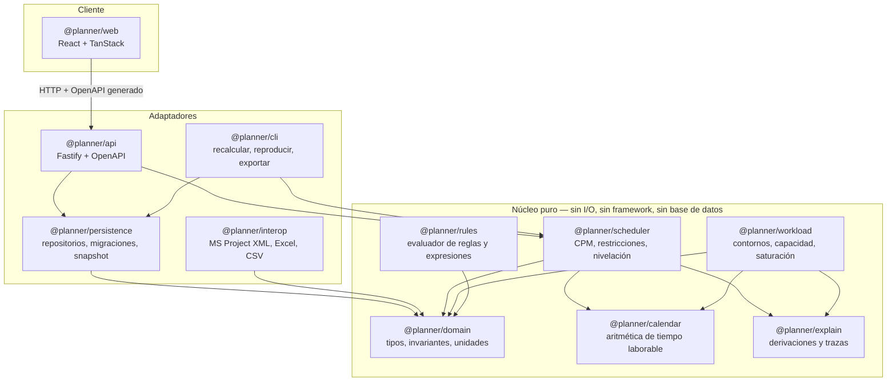

# 05 · Arquitectura técnica

## 5.1 Forma general: hexagonal, con el motor en el centro



**Regla de dependencia, sin excepciones:** las flechas apuntan hacia dentro. El núcleo
no importa Fastify, ni `pg`, ni React, ni `dayjs` con zona horaria implícita. Un
paquete del núcleo que necesite I/O es un error de diseño, no un caso especial.

Consecuencias prácticas:

- El motor se puede ejecutar en la CLI, en un test, en un *web worker* del navegador
  (para previsualización instantánea de un what-if sin ir al servidor) y en el
  servidor, con el mismo código.
- Las pruebas del núcleo no necesitan base de datos: son funciones sobre estructuras.
- Reproducir un cálculo de 2024 es `planner replay --run <id>`; si la versión del motor
  no coincide, lo dice y ofrece instalar la versión correcta.

## 5.2 Stack

| Capa | Elección | Por qué |
|------|----------|---------|
| Lenguaje | **TypeScript estricto** (`strict`, `noUncheckedIndexedAccess`, `exactOptionalPropertyTypes`) | Tipos compartidos entre motor, API y UI. Un cambio de modelo rompe la compilación en las tres capas a la vez, que es justo lo que quieres |
| Runtime | Node 22 LTS | |
| Monorepo | pnpm workspaces + Turborepo | Fronteras reales entre paquetes; la regla de dependencia se verifica en CI |
| Base de datos | **PostgreSQL 16** | `daterange` + `EXCLUDE` + particionado + JSONB + CTE recursivas. Nada de esto es opcional aquí |
| Acceso a datos | **SQL explícito** con `pg` + Kysely (constructor tipado) | Sin ORM. Las consultas de agregación son el núcleo del producto y deben ser legibles y auditables, no generadas |
| Migraciones | dbmate | SQL plano, reversible, aplicado por un job |
| API | Fastify + `@fastify/swagger`, contrato **OpenAPI generado desde Zod** | Un único contrato; el cliente TypeScript se genera, no se escribe |
| Validación | Zod en el borde | Nada entra al núcleo sin validar |
| Frontend | React 19 + Vite + TanStack Query/Table/Virtual | La cuadrícula virtualizada es el componente crítico: 5 000 filas × 60 columnas |
| Gantt | Componente propio sobre Canvas/SVG | Los Gantt comerciales traen su propio modelo de datos y su propio motor; eso reintroduce la mezcla declarado/derivado que P1 prohíbe |
| Gráficos | Visx o D3 directo | |
| Tests | Vitest + fast-check (property-based) + golden files | Ver 5.6 |
| Despliegue | Docker Compose (homelab) | Postgres + api + web + job de migración |

> **Sobre el ORM:** la decisión está razonada en [ADR-0003](../adr/0003-sin-orm.md).
> Resumen: el 70 % del valor de esta herramienta está en cinco consultas de agregación.
> Un ORM las esconde detrás de una capa que hay que auditar además del SQL.

## 5.3 Paquetes del núcleo

### `@planner/domain`
Tipos, *value objects* y unidades. Nada de lógica de aplicación.

```ts
// Unidades como tipos nominales: el compilador impide sumar minutos a puntos base.
type WorkMinutes  = number & { readonly __brand: 'WorkMinutes' }
type BasisPoints  = number & { readonly __brand: 'BasisPoints' }
type Cents        = number & { readonly __brand: 'Cents' }
type CalendarDate = string & { readonly __brand: 'CalendarDate' } // 'YYYY-MM-DD'

interface PlanSnapshot {
  readonly snapshotId: string
  readonly horizon: { from: CalendarDate; to: CalendarDate }
  readonly calendars: readonly CalendarDefinition[]
  readonly resources: readonly ResourceDefinition[]
  readonly projects: readonly ProjectDefinition[]
  readonly nodes: readonly WbsNodeDefinition[]
  readonly tasks: readonly TaskDefinition[]
  readonly dependencies: readonly DependencyDefinition[]
  readonly assignments: readonly AssignmentDefinition[]
  readonly rules: readonly RuleDefinition[]
}

interface PlanResult {
  readonly engineVersion: string
  readonly inputHash: string          // sha256 del snapshot canonicalizado
  readonly taskResults: readonly TaskResult[]
  readonly timephased: readonly TimephasedCell[]
  readonly capacity: readonly CapacityCell[]
  readonly findings: readonly Finding[]
  readonly derivations: readonly Derivation[]
  readonly stats: EngineStats
}
```

`inputHash` se calcula sobre una **serialización canónica** del snapshot (claves
ordenadas, sin espacios, sin campos irrelevantes). Es lo que permite saltarse un
recálculo idéntico y detectar que un informe antiguo salió de datos que ya cambiaron.

### `@planner/calendar`
`CompiledCalendar` y las tres primitivas del documento 04. Es el paquete con más
pruebas *property-based* del sistema:

```ts
// Propiedad: avanzar y retroceder los mismos minutos devuelve al punto de partida
fc.assert(fc.property(arbInstant, arbMinutes, arbCalendar, (t, m, cal) => {
  const fwd = addWorkingMinutes(t, m, cal)
  return workingMinutesBetween(t, fwd, cal) === m
}))
```

### `@planner/scheduler`
Los pasos 2 a 7 y 10 del documento 04. Entrada: snapshot + calendarios compilados.
Salida: `TaskResult[]` + derivaciones. Sin estado mutable compartido.

### `@planner/workload`
Pasos 8, 9 y 11. **Es el paquete que justifica el proyecto**: convierte un plan en la
respuesta a «¿cuánto tiene comprometido Ana en marzo?».

### `@planner/explain`
Recolector de derivaciones y constructor del árbol «¿por qué?». El motor le inyecta
un `DerivationSink`; en modo rápido (previsualización interactiva) el sink es un
*no-op* y el coste es cero.

### `@planner/rules`
Intérprete de un DSL pequeño y cerrado para las reglas y los campos calculados.
**Sin `eval`, sin `new Function`.** AST validado por esquema, operadores en lista
blanca, sin acceso a red ni a variables globales, con límite de pasos. Un campo
calculado mal escrito puede dar error; no puede tumbar el servidor.

## 5.4 API

REST orientada a recursos, con el recálculo como acción **explícita**:

```
GET    /api/projects/{id}/tree?run={runId}
POST   /api/nodes                          (crear tarea/paquete)
PATCH  /api/tasks/{nodeId}                 (datos declarados; devuelve impacto previsto)
POST   /api/dependencies
POST   /api/assignments
PUT    /api/resources/{id}/availability

POST   /api/scenarios/{id}/calculate       → 202 + runId  (asíncrono si > 500 ms)
GET    /api/runs/{runId}
GET    /api/runs/{runId}/findings
GET    /api/runs/{runId}/load?groupBy=resource,month&filter=…
GET    /api/runs/{runId}/explain?target=task_result.scheduled_start&id={nodeId}
GET    /api/runs/{a}/diff/{b}
POST   /api/runs/{runId}/freeze            (crear línea base)

GET    /api/export/msproject-xml?scenario={id}
POST   /api/import/excel
```

Reglas transversales:

- **Concurrencia optimista** con `If-Match` / `ETag` por entidad. Dos planificadores
  editando el mismo plan no se pisan en silencio.
- Cada mutación acepta un `X-Change-Comment` que acaba en `change_event.comment`.
- Cada respuesta que contenga números derivados incluye el `runId` que los produjo.
  **Un número sin `runId` es un bug**, porque no se puede auditar.
- Errores en formato RFC 9457 (`application/problem+json`).

## 5.5 Estrategia de recálculo

| Situación | Comportamiento |
|-----------|----------------|
| Edición de un campo en la UI | Recálculo **incremental en el navegador** (web worker) sobre el subgrafo afectado → *preview* inmediato, marcado visualmente como provisional |
| Guardar | Recálculo completo en servidor → nuevo `calculation_run` → la UI cambia del preview al resultado oficial |
| Snapshot sin cambios (`input_hash` igual) | No se recalcula; se reutiliza la ejecución previa |
| Importación masiva | Recálculo en cola, con progreso |

Que el mismo motor corra en el navegador y en el servidor no es un lujo: es la única
forma de tener respuesta instantánea **sin** un segundo motor aproximado que dé
números distintos. Un solo motor, dos ubicaciones.

## 5.6 Pruebas

| Nivel | Qué | Herramienta | Criterio |
|-------|-----|-------------|----------|
| Unitario | aritmética de calendario, contornos, ecuación de tarea | Vitest | ramas ≥ 95 % |
| Propiedades | invariantes del calendario y del reparto entero | fast-check | ≥ 10 propiedades |
| Golden files | los 40 casos del doc 04 | Vitest + snapshots JSON | diff revisado a mano |
| Esquema | invariantes de base de datos (solapes, hitos, ciclos) | psql contra cluster efímero | cada invariante tiene su test |
| Integración | API + base de datos | Testcontainers | flujos de las 10 preguntas |
| Rendimiento | 5 000 tareas / 50 recursos | banco propio en CI | < 2 s, con alerta de regresión |
| E2E | las 8 vistas | Playwright | camino feliz de cada una |

**Invariantes verificados** (PostgreSQL 16, `db/tests/invariants.sql`, en CI): el
esquema aplica y revierte sin errores; el solape de periodos de disponibilidad lo
rechaza la restricción `EXCLUDE`; un hito con duración distinta de cero lo rechaza un
`CHECK`; el historial rechaza `UPDATE` y `DELETE`; y los roles `planner_api` y
`planner_engine` no pueden escribir en la zona del otro.

## 5.7 Despliegue (homelab)

```yaml
services:
  db:        # postgres:16, volumen persistente, backup diario con pg_dump + retención
  migrate:   # job de un solo uso; el api no arranca hasta que termina bien
  api:       # @planner/api, healthcheck /healthz, réplicas 1
  web:       # estáticos servidos por caddy/nginx
  worker:    # cálculos largos, importaciones, purga de ejecuciones antiguas
```

Observabilidad mínima pero real: logs estructurados JSON con `request_id` propagado
hasta `change_event`, métricas Prometheus (`calc_duration_ms`, `calc_tasks_total`,
`findings_by_severity`), y un `/healthz` que comprueba la base de datos y la versión
de esquema esperada.
